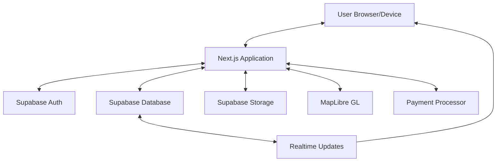

# Design Document: We-Clean.app

## Overview

We-Clean.app is a comprehensive SaaS platform for cleaning businesses that connects administrators, managers, cleaning teams, and customers through a unified system. The platform features role-specific dashboards, job scheduling and tracking, GPS location services, photo verification, invoicing, and analytics—all presented with a distinctive pink glassmorphism design aesthetic.

The application will be built as a Progressive Web App (PWA) using Next.js 14 with React Server Components, providing a responsive and app-like experience across devices while maintaining excellent performance and SEO benefits.

## Architecture

### System Architecture

We-Clean.app will follow a modern web application architecture with the following components:

1. **Frontend Layer**
   - Next.js 14 with App Router for page routing and server components
   - React 18 for UI components and client-side interactivity
   - Progressive Web App (PWA) capabilities for offline access and mobile installation

2. **Backend Services**
   - Next.js API routes for server-side logic
   - Supabase for authentication, database, and storage
   - Real-time subscription services for live updates

3. **External Integrations**
   - MapLibre GL for mapping and location services
   - Payment processing services (to be determined)
   - Push notification services

### Data Flow Architecture



### Deployment Architecture

The application will be deployed as a Next.js application with Supabase as the backend service. The deployment will include:

1. **Frontend Hosting**
   - Vercel or similar platform optimized for Next.js
   - CDN for static assets
   - Edge functions for API routes

2. **Backend Services**
   - Supabase project for database, authentication, and storage
   - Scheduled functions for recurring tasks

## Components and Interfaces

### Core Components

#### Authentication Components
- `LoginForm`: Email/password authentication form
- `RegisterForm`: New user registration with role selection
- `AuthProvider`: Context provider for authentication state
- `RoleGuard`: Component to restrict access based on user role

#### Dashboard Components
- `DashboardLayout`: Base layout for all dashboard views with sidebar navigation
- `AdminDashboard`: Overview for administrators
- `ManagerDashboard`: Tools for team and job management
- `TeamDashboard`: Job assignments and completion tools
- `CustomerDashboard`: Service scheduling and history

#### Job Management Components
- `JobCard`: Reusable component for displaying job information
- `JobCreationForm`: Form for creating and editing jobs
- `JobDetailsView`: Comprehensive view of a single job
- `JobStatusUpdater`: Component for updating job status
- `JobFilterBar`: Filtering and sorting options for job lists

#### Map Components
- `MapView`: Main map display component using MapLibre GL
- `LocationMarker`: Component for displaying locations on the map
- `RouteOptimizer`: Component for suggesting optimal routes
- `TeamLocationTracker`: Real-time team member location tracking

#### Photo Verification Components
- `PhotoUploader`: Component for capturing and uploading photos
- `BeforeAfterComparison`: Side-by-side comparison of before/after photos
- `PhotoGallery`: Display of job-related photos

#### White-Label Components
- `ThemeProvider`: Context provider for theme customization
- `BrandingSettings`: Admin interface for customizing appearance
- `LogoUploader`: Component for uploading and managing custom logos

#### Multilingual Components
- `LanguageSelector`: Component for changing language preference
- `TranslationProvider`: Context provider for multilingual text

#### Invoice and Payment Components
- `InvoiceGenerator`: Component for creating invoices
- `InvoiceViewer`: Display of invoice details
- `PaymentProcessor`: Interface for processing payments
- `PaymentStatusIndicator`: Visual indicator of payment status

#### Review and Rating Components
- `ReviewForm`: Form for submitting reviews and ratings
- `RatingDisplay`: Visual display of ratings
- `ReviewsList`: List of reviews with filtering options

#### Analytics Components
- `AnalyticsDashboard`: Overview of key metrics
- `PerformanceChart`: Visual representation of performance data
- `RevenueReport`: Financial performance visualization
- `TeamEfficiencyMetrics`: Team performance analytics

#### Helper/Assistant Components
- `HelperBot`: Interactive assistant interface
- `ContextualHelp`: Context-sensitive help tooltips
- `OnboardingTutorial`: Step-by-step guide for new users

#### Notification Components
- `NotificationCenter`: Central hub for all notifications
- `NotificationBadge`: Visual indicator of unread notifications
- `NotificationSettings`: User preferences for notifications

### Interface Design

The user interface will follow the pink glassmorphism design aesthetic with the following color palette:

- Primary: #EC4899 (pink-500)
- Secondary: #F472B6 (pink-400)
- Accent: #FBBF24 (amber-400)
- Background: #FDF2F8 (pink-50)
- Glass: rgba(236, 72, 153, 0.1)
- Border: rgba(236, 72, 153, 0.2)
- Text: #1F2937 (gray-800)
- Muted: #6B7280 (gray-500)

The interface will incorporate glassmorphism effects with:
- Subtle transparency
- Blur effects
- Soft shadows
- Rounded corners
- Thin borders

All components will be built using shadcn/ui as a foundation, customized to match the design aesthetic.

## Data Models

### User Model
```typescript
interface User {
  id: string;
  email: string;
  role: 'admin' | 'manager' | 'team' | 'customer';
  firstName: string;
  lastName: string;
  phoneNumber?: string;
  profileImage?: string;
  language: 'en' | 'es' | 'pt';
  createdAt: string;
  updatedAt: string;
  businessId?: string; // For admin, manager, team roles
  settings: UserSettings;
}

interface UserSettings {
  theme: ThemeSettings;
  notifications: NotificationSettings;
}
```

### Business Model
```typescript
interface Business {
  id: string;
  name: string;
  logo?: string;
  address: Address;
  phoneNumber: string;
  email: string;
  website?: string;
  branding: BrandingSettings;
  services: Service[];
  createdAt: string;
  updatedAt: string;
}

interface BrandingSettings {
  primaryColor: string;
  secondaryColor: string;
  accentColor: string;
  logo?: string;
  companyName: string;
}
```

### Job Model
```typescript
interface Job {
  id: string;
  businessId: string;
  customerId: string;
  title: string;
  description: string;
  status: 'scheduled' | 'in_progress' | 'completed' | 'cancelled';
  scheduledStart: string;
  scheduledEnd: string;
  actualStart?: string;
  actualEnd?: string;
  location: Location;
  serviceIds: string[];
  assignedTeamMembers: string[];
  notes?: string;
  photos: JobPhoto[];
  invoice?: Invoice;
  review?: Review;
  createdAt: string;
  updatedAt: string;
}

interface JobPhoto {
  id: string;
  jobId: string;
  url: string;
  type: 'before' | 'after' | 'issue' | 'other';
  caption?: string;
  createdAt: string;
}
```

### Service Model
```typescript
interface Service {
  id: string;
  businessId: string;
  name: string;
  description: string;
  duration: number; // in minutes
  price: number;
  isActive: boolean;
  createdAt: string;
  updatedAt: string;
}
```

### Invoice Model
```typescript
interface Invoice {
  id: string;
  jobId: string;
  businessId: string;
  customerId: string;
  amount: number;
  tax: number;
  total: number;
  status: 'draft' | 'sent' | 'paid' | 'overdue' | 'cancelled';
  dueDate: string;
  items: InvoiceItem[];
  notes?: string;
  createdAt: string;
  updatedAt: string;
  paidAt?: string;
}

interface InvoiceItem {
  id: string;
  invoiceId: string;
  description: string;
  quantity: number;
  unitPrice: number;
  amount: number;
}
```

### Review Model
```typescript
interface Review {
  id: string;
  jobId: string;
  customerId: string;
  rating: number; // 1-5
  comment?: string;
  response?: string; // Business response to review
  createdAt: string;
  updatedAt: string;
}
```

### Location Model
```typescript
interface Location {
  address: Address;
  coordinates: {
    latitude: number;
    longitude: number;
  };
}

interface Address {
  street: string;
  city: string;
  state: string;
  postalCode: string;
  country: string;
  formattedAddress: string;
}
```

### Notification Model
```typescript
interface Notification {
  id: string;
  userId: string;
  type: 'job_assigned' | 'status_update' | 'review_received' | 'payment_received' | 'system';
  title: string;
  message: string;
  isRead: boolean;
  relatedId?: string; // ID of related entity (job, invoice, etc.)
  createdAt: string;
}
```

## Database Schema

The database will be implemented in Supabase (PostgreSQL) with the following tables:

### Tables

1. **users**
   - Primary key: id (UUID)
   - Foreign keys: business_id (to businesses.id)
   - Indexes: email, role

2. **businesses**
   - Primary key: id (UUID)
   - Indexes: name

3. **jobs**
   - Primary key: id (UUID)
   - Foreign keys: business_id, customer_id
   - Indexes: status, scheduled_start, business_id, customer_id

4. **job_team_members**
   - Composite primary key: job_id, user_id
   - Foreign keys: job_id, user_id

5. **services**
   - Primary key: id (UUID)
   - Foreign key: business_id
   - Indexes: business_id

6. **job_services**
   - Composite primary key: job_id, service_id
   - Foreign keys: job_id, service_id

7. **job_photos**
   - Primary key: id (UUID)
   - Foreign key: job_id
   - Indexes: job_id, type

8. **invoices**
   - Primary key: id (UUID)
   - Foreign keys: job_id, business_id, customer_id
   - Indexes: status, due_date

9. **invoice_items**
   - Primary key: id (UUID)
   - Foreign key: invoice_id
   - Indexes: invoice_id

10. **reviews**
    - Primary key: id (UUID)
    - Foreign keys: job_id, customer_id
    - Indexes: rating

11. **notifications**
    - Primary key: id (UUID)
    - Foreign key: user_id
    - Indexes: user_id, is_read, created_at

12. **team_locations**
    - Primary key: id (UUID)
    - Foreign key: user_id
    - Indexes: user_id, timestamp

### Row-Level Security (RLS)

Supabase RLS policies will be implemented to ensure data security:

1. Users can only access data related to their business
2. Team members can only view their assigned jobs
3. Customers can only view their own jobs and invoices
4. Admins and managers have broader access within their business

## Authentication and Authorization

### Authentication Flow

1. Users register or log in through Supabase Auth
2. JWT tokens are used for session management
3. Role-based access control determines available features

### Authorization Matrix

| Feature | Admin | Manager | Team | Customer |
|---------|-------|---------|------|----------|
| View All Jobs | ✓ | ✓ | - | - |
| Create Jobs | ✓ | ✓ | - | ✓ |
| Assign Jobs | ✓ | ✓ | - | - |
| Update Job Status | ✓ | ✓ | ✓ | - |
| Upload Photos | ✓ | ✓ | ✓ | - |
| View Analytics | ✓ | ✓ | - | - |
| Manage Team | ✓ | ✓ | - | - |
| Customize Branding | ✓ | - | - | - |
| Manage Services | ✓ | ✓ | - | - |
| Create Invoices | ✓ | ✓ | - | - |
| View Own Jobs | ✓ | ✓ | ✓ | ✓ |
| Submit Reviews | - | - | - | ✓ |

## Error Handling

### Error Types

1. **Authentication Errors**
   - Invalid credentials
   - Expired sessions
   - Insufficient permissions

2. **Data Validation Errors**
   - Missing required fields
   - Invalid data formats
   - Business logic violations

3. **API Errors**
   - External service failures
   - Rate limiting
   - Network issues

4. **Resource Errors**
   - Not found
   - Already exists
   - Conflict with existing data

### Error Handling Strategy

1. **Client-Side Validation**
   - Form validation using React Hook Form
   - Data type checking with TypeScript
   - Immediate feedback to users

2. **Server-Side Validation**
   - Comprehensive validation in API routes
   - Database constraints and triggers
   - Proper error codes and messages

3. **User Feedback**
   - Toast notifications for errors
   - Inline form validation messages
   - Guided recovery steps

4. **Error Logging**
   - Structured error logging
   - Error categorization
   - Performance monitoring

## Testing Strategy

### Testing Levels

1. **Unit Testing**
   - Component testing with React Testing Library
   - Utility function testing
   - Isolated business logic testing

2. **Integration Testing**
   - API route testing
   - Database interaction testing
   - Authentication flow testing

3. **End-to-End Testing**
   - Critical user journeys
   - Cross-browser compatibility
   - Mobile responsiveness

### Testing Tools

1. **Jest** for unit and integration tests
2. **React Testing Library** for component testing
3. **Cypress** for end-to-end testing
4. **Storybook** for component development and visual testing

### Test Coverage Goals

- 80% code coverage for core business logic
- 100% coverage for critical paths (authentication, job creation, payment processing)
- All components visually tested in Storybook

## Performance Considerations

1. **Server-Side Rendering**
   - Utilize Next.js SSR for initial page loads
   - Implement streaming for large data sets

2. **Data Fetching Optimization**
   - Implement efficient data fetching patterns
   - Use React Query for client-side data management
   - Implement pagination for large data sets

3. **Asset Optimization**
   - Image optimization with Next.js Image component
   - Code splitting and lazy loading
   - Efficient bundling with webpack

4. **Caching Strategy**
   - Implement SWR for data caching
   - Use service workers for offline capabilities
   - CDN caching for static assets

## Security Considerations

1. **Authentication Security**
   - Secure password policies
   - Multi-factor authentication option
   - Session management and timeout

2. **Data Protection**
   - Row-level security in Supabase
   - Data encryption for sensitive information
   - Secure API endpoints

3. **Input Validation**
   - Comprehensive server-side validation
   - Protection against common vulnerabilities (XSS, CSRF)
   - Rate limiting for sensitive operations

4. **Privacy Compliance**
   - GDPR-compliant data handling
   - Data minimization principles
   - User consent management

## Internationalization (i18n)

1. **Translation Strategy**
   - JSON-based translation files
   - Dynamic loading based on user preference
   - Fallback language (English)

2. **Supported Languages**
   - English (en)
   - Spanish (es)
   - Portuguese (pt)

3. **Localization Considerations**
   - Date and time formatting
   - Currency formatting
   - Address formatting

## Accessibility (a11y)

1. **Accessibility Standards**
   - WCAG 2.1 AA compliance
   - Keyboard navigation support
   - Screen reader compatibility

2. **Implementation Approach**
   - Semantic HTML
   - ARIA attributes where necessary
   - Focus management
   - Color contrast compliance

## Progressive Web App (PWA) Features

1. **Offline Capabilities**
   - Service worker for offline access
   - Cached resources and data
   - Offline job updates with sync when online

2. **Installation Experience**
   - App manifest for home screen installation
   - Custom icons and splash screens
   - Native-like experience

3. **Push Notifications**
   - Job status updates
   - New assignments
   - Payment notifications

## Implementation Priorities

1. **Phase 1: Core Platform**
   - Authentication and user management
   - Basic dashboard structure
   - Job creation and management
   - Map integration

2. **Phase 2: Enhanced Features**
   - Photo verification system
   - Invoice generation
   - Real-time updates
   - Analytics dashboard

3. **Phase 3: Advanced Capabilities**
   - White-label customization
   - Helper/assistant system
   - Advanced reporting
   - Mobile optimizations

## Technical Debt Considerations

1. **Code Quality**
   - Consistent coding standards
   - Comprehensive documentation
   - Regular refactoring

2. **Testing Coverage**
   - Maintain test coverage as features are added
   - Automated testing in CI/CD pipeline

3. **Dependency Management**
   - Regular updates of dependencies
   - Security vulnerability monitoring
   - Minimal external dependencies